# Generator Prostego Budżetu

**Generator Prostego Budżetu** to aplikacja webowa służąca do zarządzania finansami osobistymi. Jej celem jest umożliwienie użytkownikowi pełnej kontroli nad swoimi przychodami i wydatkami w prosty, przejrzysty sposób — bez zbędnych komplikacji.

Po zarejestrowaniu i zalogowaniu się użytkownik otrzymuje dostęp do spersonalizowanego panelu finansowego, w którym może na bieżąco śledzić swój bilans, dodawać operacje finansowe z przypisaniem do kategorii, przeglądać historię transakcji oraz tworzyć plan oszczędnościowy z prognozą realizacji celu. Aplikacja oferuje również eksport raportu finansowego do formatu PDF oraz import danych z pliku lub bezpośrednio z wybranych banków.

Projekt został zrealizowany z wykorzystaniem React 18 i Vite jako środowiska deweloperskiego, Firebase Authentication do obsługi logowania (e-mail/hasło oraz Google), Cloud Firestore jako bazy danych oraz Tailwind CSS do stylowania interfejsu. Aplikacja jest wdrożona na platformie Netlify z automatycznym CI/CD przez GitHub.

**Link do aplikacji:** [https://generator-prostego-budzetu.netlify.app](https://generator-prostego-budzetu.netlify.app)

**Repozytorium:** [github.com/BartoszDutka/generator-prostego-budzetu](https://github.com/BartoszDutka/generator-prostego-budzetu)

---

## Technologie

React 18 · Vite · React Router v6 · Firebase Authentication · Cloud Firestore · Tailwind CSS · Google Analytics 4 · Contentsquare · Netlify

---

## Uruchomienie lokalne

```bash
npm install
npm run dev
```

---

## Screeny aplikacji

### Strona główna

Publiczna strona powitalna zawierająca sekcję hero z nagłówkiem i przyciskami CTA („Rozpocznij teraz" oraz „Jak to działa?"), opis czterech głównych funkcji aplikacji (Dodawaj przychody, Dodawaj wydatki, Analizuj budżet, Przeglądaj historię) oraz podgląd panelu finansowego z wykresami.

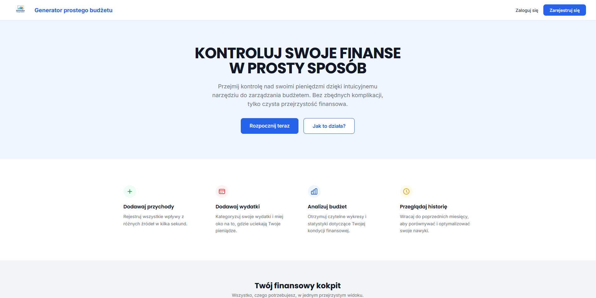

---

### Logowanie

Formularz logowania dostępny pod adresem `/login`. Użytkownik może zalogować się przy użyciu adresu e-mail i hasła lub kliknąć przycisk „Zaloguj się przez Google", który uruchamia przepływ OAuth 2.0 przez Firebase Authentication.

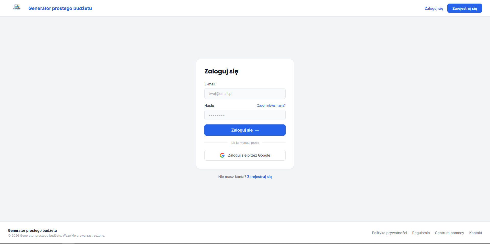

---

### Rejestracja

Formularz rejestracji dostępny pod adresem `/register`. Użytkownik podaje imię, nazwisko, adres e-mail, hasło oraz potwierdzenie hasła. Możliwa jest również rejestracja przez konto Google.

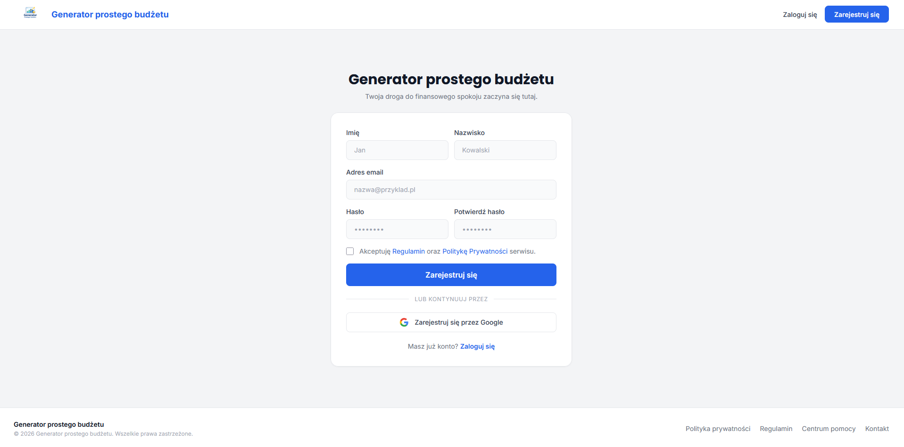

---

### Dashboard - Panel użytkownika

Główny widok po zalogowaniu, dostępny pod adresem `/dashboard`. Wyświetla trzy karty statystyk: aktualny bilans, sumę przychodów i sumę wydatków. Poniżej znajduje się wykres wydatków według kategorii, karta największego wydatku oraz przycisk tworzenia planu oszczędnościowego.

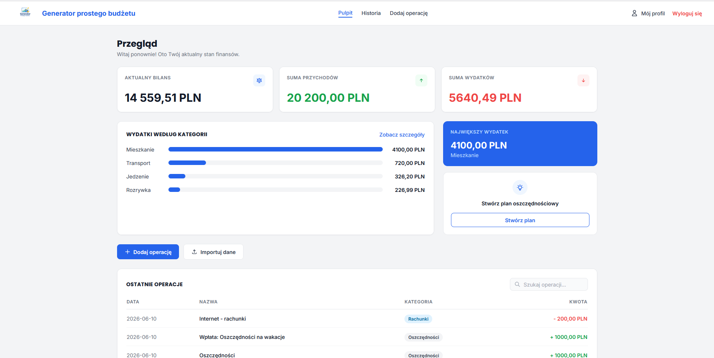

Dolna część dashboardu zawiera tabelę ostatnich operacji z możliwością wyszukiwania. Każda operacja jest oznaczona kategorią, typem (wydatek/przychód) i kwotą.

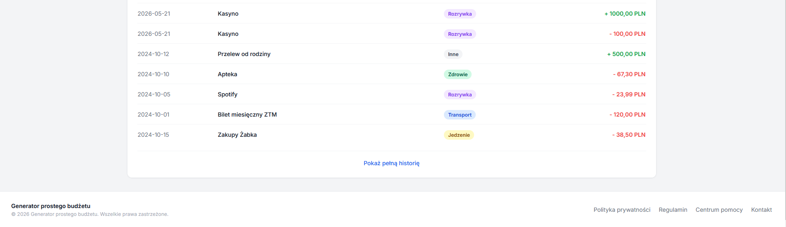

Po kliknięciu przycisku „Importuj dane" otwiera się modal umożliwiający wgranie pliku CSV lub PDF, a także bezpośredni import z wybranych banków (PKO BP, mBank, ING Bank).

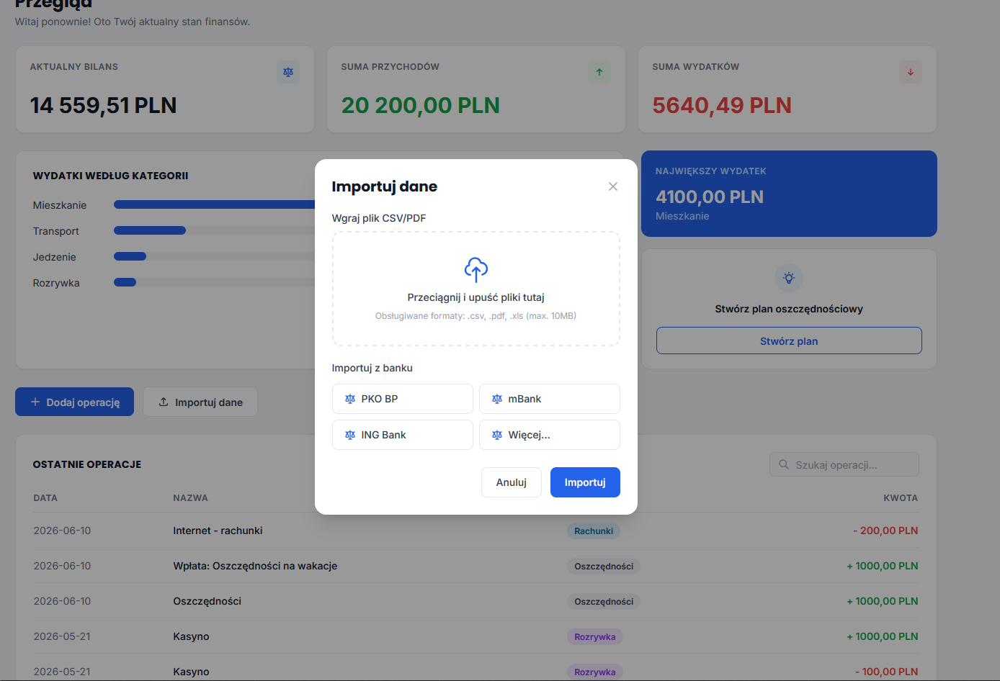

---

### Dodawanie operacji

Widok dostępny pod adresem `/add`. Użytkownik wybiera typ operacji (Wydatek lub Przychód), wpisuje kwotę, wybiera datę i kategorię (np. Mieszkanie, Jedzenie, Transport, Rozrywka) oraz opcjonalny opis.

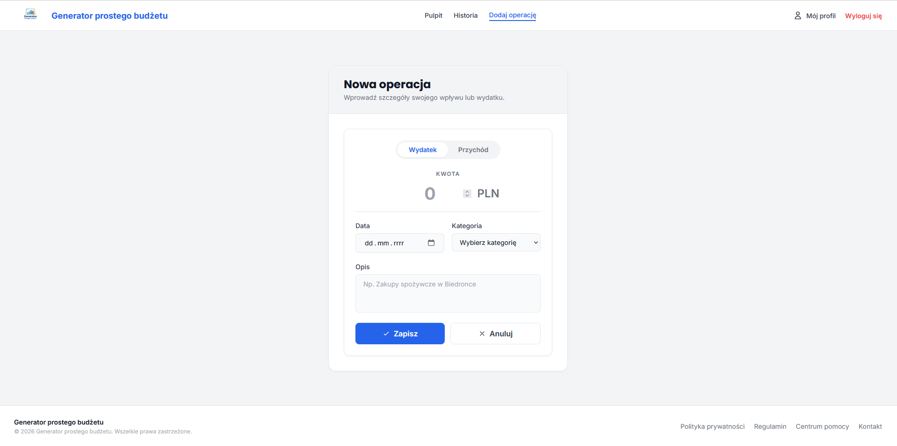

---

### Historia operacji

Widok dostępny pod adresem `/history`. Wyświetla pełną listę wszystkich operacji posortowaną po dacie. Każda pozycja zawiera ikonę kategorii w kolorowym kwadracie, datę, opis, typ operacji oraz kwotę. Dostępne jest filtrowanie po kategorii i typie.

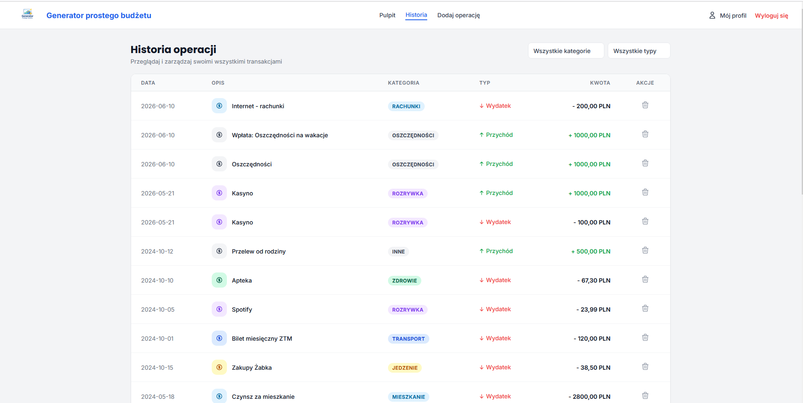

---

### Plan oszczędnościowy

Widok dostępny pod adresem `/plan`. Wyświetla kartę aktywnego celu oszczędnościowego z nazwą, kwotą docelową, terminem, paskiem progresu i procentem ukończenia. Obok widnieje karta z rekomendacją i przyciskiem do dodawania wpłat. Poniżej znajduje się wykres prognozy oszczędności na kolejne 6 miesięcy.

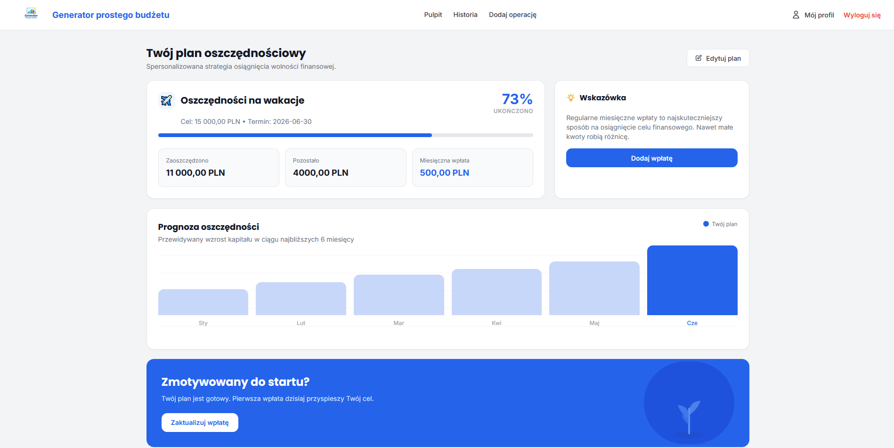

Po kliknięciu „Dodaj wpłatę" otwiera się modal, w którym użytkownik wpisuje kwotę wpłaty i datę. Na bieżąco wyświetlana jest kwota zaoszczędzona po wpłacie.

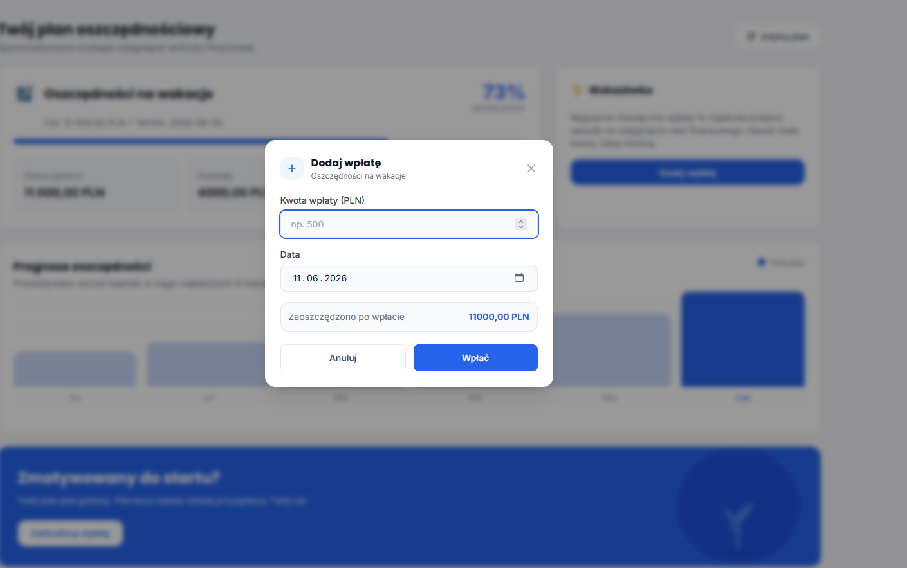

---

### Profil użytkownika

Widok dostępny pod adresem `/profile`. Zawiera formularz edycji danych osobowych (imię, nazwisko, adres e-mail) oraz sekcję zmiany hasła. W prawym górnym rogu dostępna jest opcja trwałego usunięcia konta wraz z wszystkimi danymi.

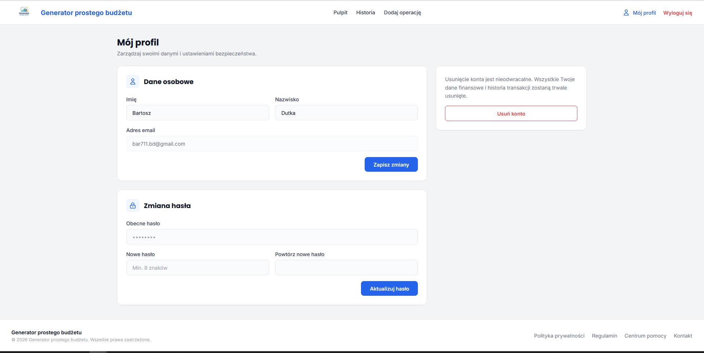

---

### Jak to działa

Strona informacyjna dostępna pod adresem `/jak-to-dziala`. Opisuje trzy kroki korzystania z aplikacji: założenie konta, dodawanie transakcji i analizowanie wydatków. Strona zawiera ilustrację z laptopem oraz sekcję CTA zachęcającą do rejestracji.

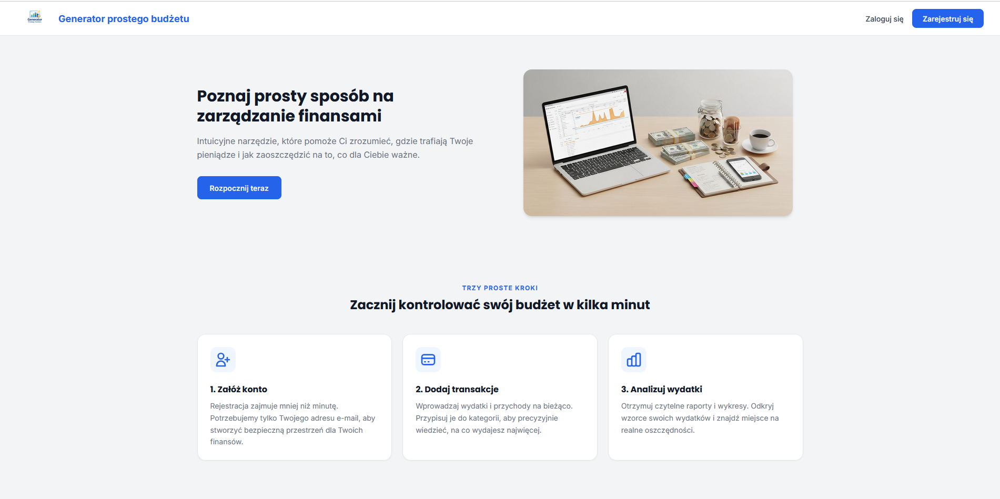

---

### Centrum pomocy

Strona dostępna pod adresem `/pomoc`. Zawiera sekcję wyszukiwarki, kategorie tematyczne (Pierwsze kroki, Bezpieczeństwo, Obsługa konta) oraz listę najczęściej zadawanych pytań w formie akordeonu. W prawym dolnym rogu widoczna jest karta kontaktowa z ilustracją.

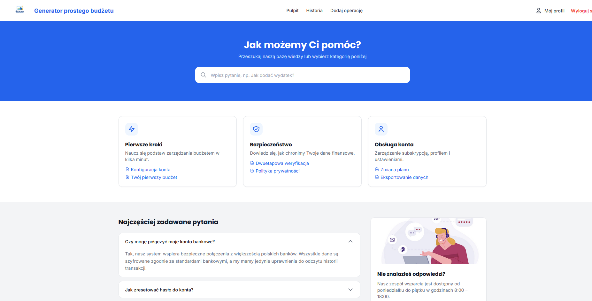

---

### Kontakt

Strona dostępna pod adresem `/kontakt`. Zawiera formularz kontaktowy z polami: imię i nazwisko, adres e-mail, temat i treść wiadomości. Po prawej stronie wyświetlane są dane adresowe biura, e-mail i telefon.

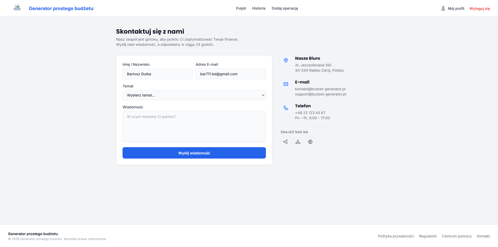

---

### Strona 404

Własna strona błędu wyświetlana dla nieistniejących adresów URL. Zawiera czytelny komunikat oraz przyciski powrotu do strony głównej i przejścia do centrum pomocy.

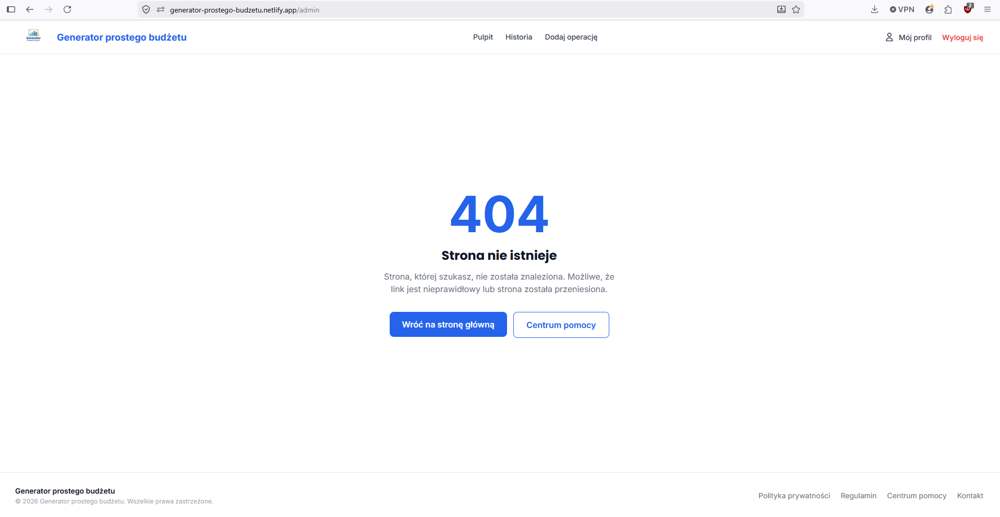

---

## Google Analytics

Aplikacja jest zintegrowana z Google Analytics 4 przy użyciu biblioteki `react-ga4`. Komponent `AnalyticsListener` jest osadzony wewnątrz `BrowserRouter` i nasłuchuje każdej zmiany trasy - przy każdym przejściu na inną stronę automatycznie wysyła zdarzenie `page_view` do GA4. Rejestrowane są również zdarzenia `session_start`, `first_visit`, `user_engagement` i `scroll`.

W trakcie testowania zebrano dane od 7 aktywnych użytkowników, którzy wykonali łącznie 451 odsłon stron i wygenerowali 506 zdarzeń. Najpopularniejsze trasy to `/dashboard` (130 odsłon), `/add` (110 odsłon) i `/history` (51 odsłon).

---

Widok czasu rzeczywistego w GA4 - potwierdza aktywne śledzenie użytkowników. Widoczna jest mapa z lokalizacjami, liczba aktywnych użytkowników w ostatnich 30 minutach oraz lista rejestrowanych zdarzeń (`page_view`, `first_visit`, `session_start`).

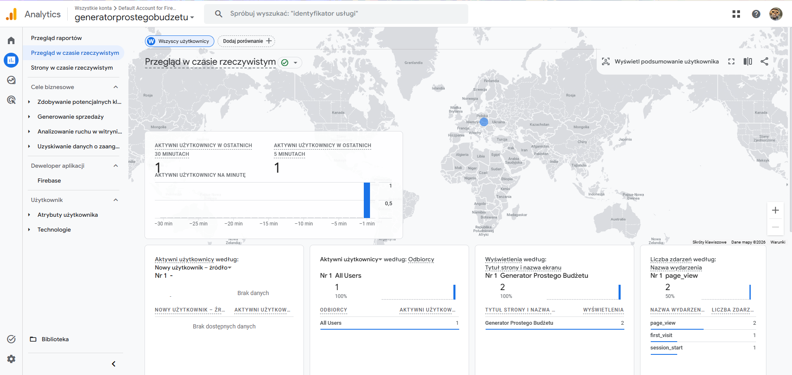

---

Przegląd raportów GA4 - pokazuje łączną liczbę aktywnych użytkowników (7), nowych użytkowników (11), średni czas zaangażowania (3 min 44 s) oraz całkowitą liczbę zdarzeń (506).

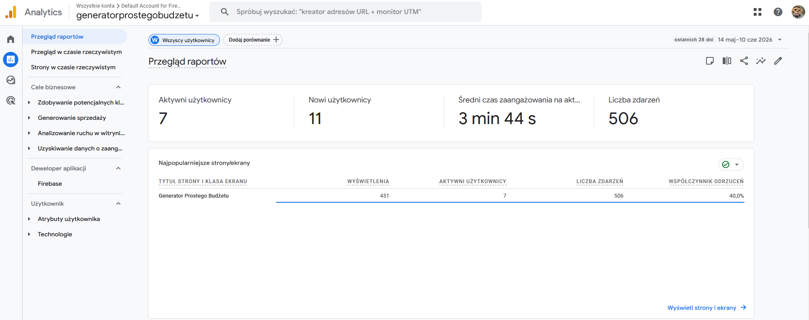

---

Szczegółowy raport GA4 - widoczne dane o źródłach sesji (direct/none - 7 sesji, app.contentsquare.com - 2 sesje), wykres nowych i powracających użytkowników w czasie, aktywni użytkownicy według miast (Katowice, Kraków, Rabka-Zdrój, Warsaw, Wrocław) oraz łączna liczba aktywnych odbiorców (7).

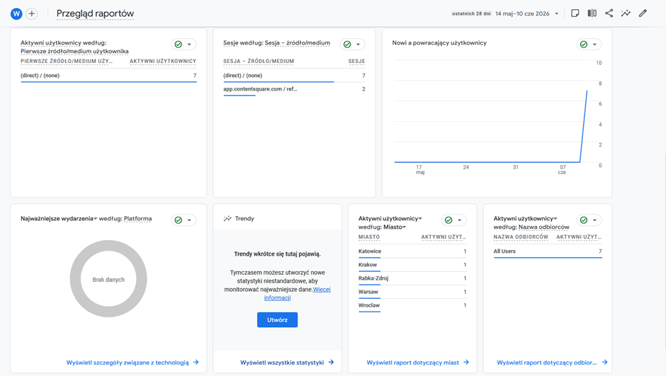

---

Raport stron - lista wszystkich tras aplikacji z liczbą wyświetleń, aktywnymi użytkownikami i liczbą zdarzeń. Potwierdza, że każda podstrona jest śledzona oddzielnie.

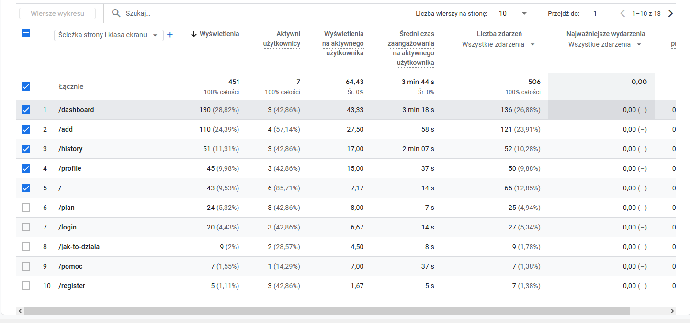

---

Kod komponentu `AnalyticsListener.jsx` - przy każdej zmianie lokalizacji (trasy) wysyłany jest `pageview` z aktualną ścieżką URL do GA4 przez bibliotekę `react-ga4`.

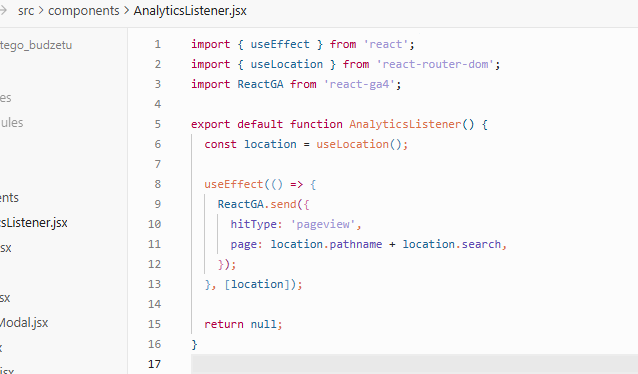

---

## Hotjar / Contentsquare

Aplikacja jest zintegrowana z Contentsquare (następcą Hotjar) poprzez skrypt śledzący załadowany bezpośrednio w pliku `index.html`. Narzędzie rejestruje każdą sesję użytkownika i umożliwia pełną analizę zachowań: kliknięcia, ruchy myszy, scrollowanie, nagrania sesji oraz analizę stref strony.

---

Potwierdzenie poprawnej instalacji skryptu Contentsquare - narzędzie zweryfikowało adres URL aplikacji i wyświetliło komunikat „Installation successful!", co oznacza, że dane są zbierane prawidłowo.

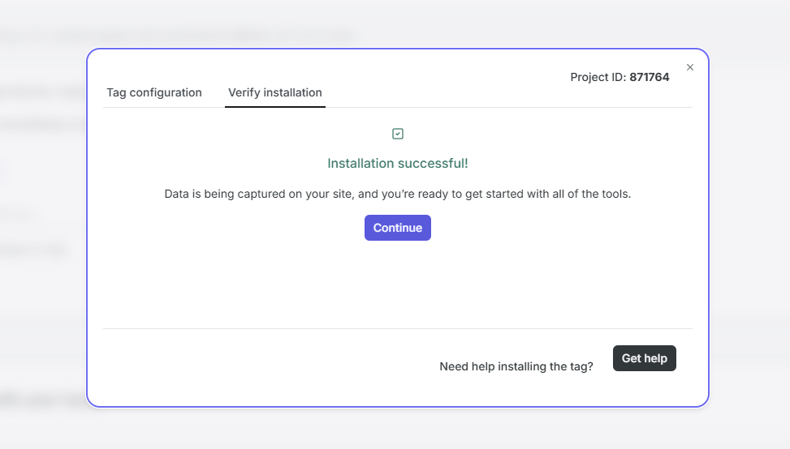

---

Panel główny Contentsquare - widok po zalogowaniu do panelu analitycznego. Widoczne są statystyki z ostatnich 7 dni: liczba sesji, bounce rate, czas sesji oraz LCP. Narzędzie przywitało użytkownika i zaproponowało dalszą analizę danych.

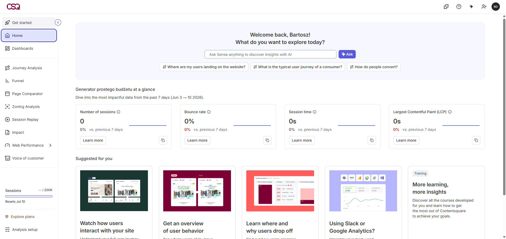

---

Heatmapa kliknięć na stronie Dashboard - wizualizacja najczęściej klikanych elementów. Niebieskie plamy wskazują miejsca o największej koncentracji kliknięć. Aktywne przyciski nawigacyjne i karty bilansu są wyraźnie wyróżnione.

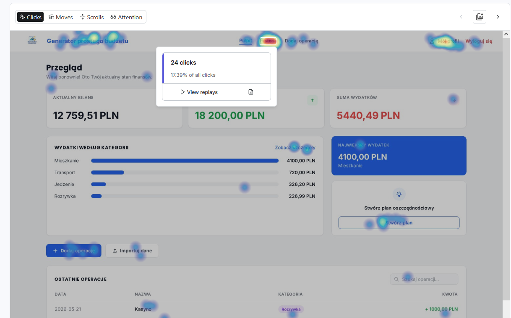

---

Heatmapa ruchów myszy na stronie Dashboard - pokazuje trajektorie, po których poruszał się kursor użytkownika. Widoczna jest koncentracja ruchów wokół paska nawigacji i kart statystyk.

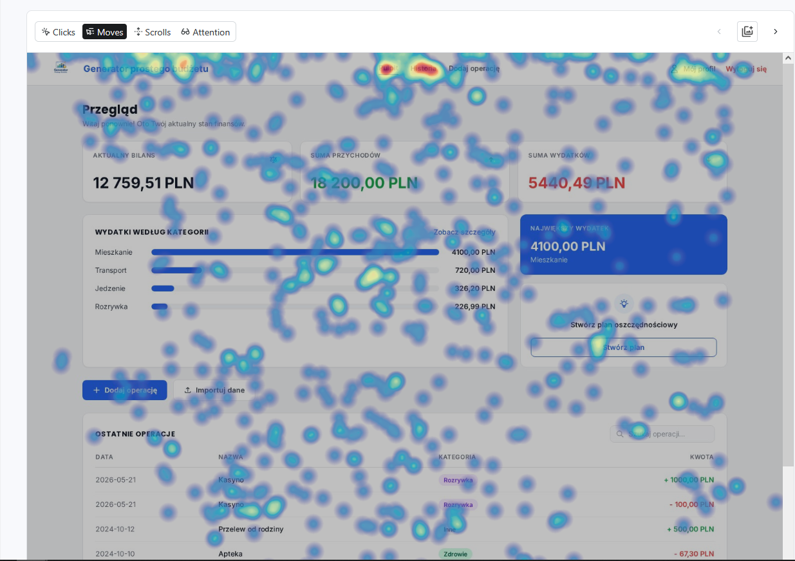

---

Scroll map strony Dashboard - czerwony kolor oznacza, że 100% użytkowników dotarło do tej części strony. Zielony obszar poniżej wskazuje miejsca, do których dotarła mniejsza liczba osób. Narzędzie oznaczyło linię „Average fold" - punkt, do którego przeciętny użytkownik scrolluje bez dodatkowego działania.

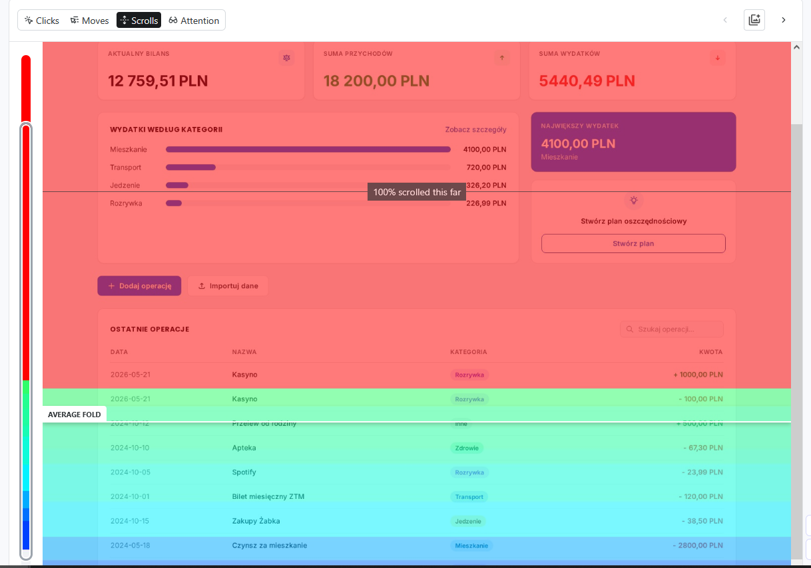

---

Zoning Analysis strony Dashboard - każda sekcja strony jest oznaczona procentem kliknięć, jakie w niej odnotowano. Pozwala to ocenić, które elementy interfejsu przyciągają największą uwagę użytkowników.

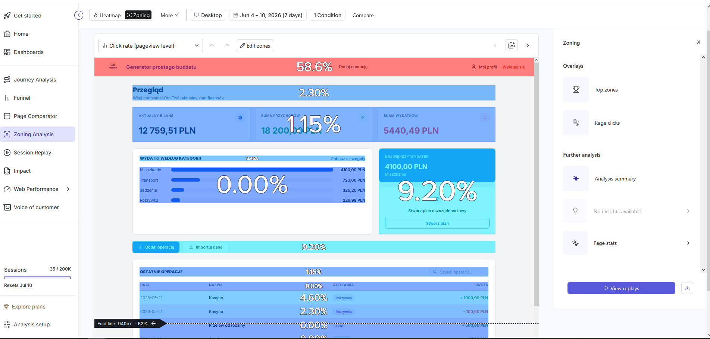

---

Lista nagranych sesji - zestawienie wszystkich zarejestrowanych nagrań sesji z datą, czasem trwania, liczbą odwiedzonych stron i liczbą zdarzeń. Każdą sesję można odtworzyć jako nagranie wideo.

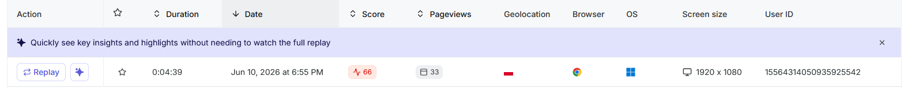

---

Odtwarzacz nagrania sesji - widok konkretnej sesji użytkownika odwiedzającego stronę `/add`. Po lewej stronie widoczna jest lista odwiedzonych tras w kolejności, a na środku podgląd ekranu użytkownika w trakcie wizyty.

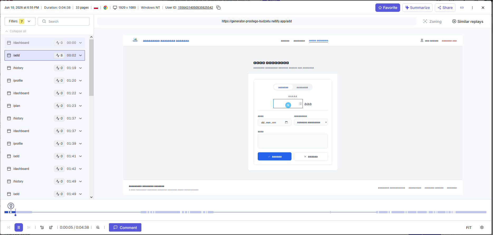

---

## Autorzy

**Bartosz Dutka**  
**Patryk Gal**  
Politechnika Krakowska  
Przedmiot: TPF - Technologie i Platformy Frontendowe  
Rok akademicki: 2025/2026
