# Generator Prostego Budżetu

> Aplikacja webowa do zarządzania budżetem osobistym — zbudowana w React 18 + Vite, z Firebase Authentication, Cloud Firestore, Google Analytics 4 oraz Contentsquare. Wdrożona na Netlify.

---

## Spis treści

1. [Opis projektu](#opis-projektu)
2. [Link do aplikacji](#link-do-aplikacji)
3. [Najważniejsze funkcjonalności](#najważniejsze-funkcjonalności)
4. [Technologie](#technologie)
5. [Uruchomienie projektu lokalnie](#uruchomienie-projektu-lokalnie)
6. [Zmienne środowiskowe](#zmienne-środowiskowe)
7. [Struktura projektu](#struktura-projektu)
8. [Routing](#routing)
9. [Firebase Authentication](#firebase-authentication)
10. [Cloud Firestore](#cloud-firestore)
11. [Google Analytics](#google-analytics)
12. [Hotjar / Contentsquare](#hotjar--contentsquare)
13. [Deploy na Netlify](#deploy-na-netlify)
14. [Screeny aplikacji](#screeny-aplikacji)
15. [Problemy napotkane podczas realizacji](#problemy-napotkane-podczas-realizacji)
16. [Podsumowanie](#podsumowanie)
17. [Autor](#autor)

---

## Opis projektu

**Generator Prostego Budżetu** to aplikacja webowa służąca do zarządzania finansami osobistymi. Projekt powstał jako praca zaliczeniowa z przedmiotu **TPF (Technologie i Platformy Frontendowe)** na Politechnice Krakowskiej w roku akademickim 2025/2026.

Aplikacja pozwala użytkownikowi na:
- przeglądanie aktualnego stanu finansów na czytelnym dashboardzie,
- dodawanie przychodów i wydatków z przypisaniem do kategorii,
- przeglądanie pełnej historii operacji finansowych,
- tworzenie planu oszczędnościowego i śledzenie jego realizacji,
- zarządzanie danymi osobowymi i hasłem w profilu użytkownika,
- eksport raportu finansowego do formatu PDF,
- import danych z pliku CSV/PDF lub bezpośrednio z banku.

Projekt spełnia wszystkie wymagania checklist TPF: routing (React Router), autoryzacja (Firebase Auth), baza danych (Cloud Firestore), analityka (Google Analytics 4, Contentsquare) oraz deployment (Netlify).

---

## Link do aplikacji

Aplikacja jest publicznie dostępna pod adresem:

**[https://generator-prostego-budzetu.netlify.app](https://generator-prostego-budzetu.netlify.app)**

---

## Najważniejsze funkcjonalności

### Autoryzacja i bezpieczeństwo
- Rejestracja nowego konta (imię, nazwisko, e-mail, hasło)
- Logowanie przez e-mail i hasło
- Logowanie przez konto Google (OAuth 2.0 — Firebase Authentication)
- Wylogowanie użytkownika
- Chronione trasy (`ProtectedRoute`) — niezalogowani użytkownicy są automatycznie przekierowywani na stronę `/login`
- Zmiana hasła i usunięcie konta z poziomu profilu
- Reguły bezpieczeństwa Firestore ograniczające dostęp wyłącznie do danych właściciela

### Panel użytkownika (Dashboard)
- Aktualny bilans, suma przychodów i suma wydatków
- Wykres wydatków według kategorii (Mieszkanie, Transport, Jedzenie, Rozrywka...)
- Karta "Największy wydatek"
- Tabela ostatnich operacji z wyszukiwarką
- Przycisk szybkiego dodawania operacji
- Modal importu danych z pliku lub banku (PKO BP, mBank, ING Bank)

### Operacje finansowe
- Dodawanie wydatków i przychodów z datą, kwotą, kategorią i opisem
- Historia wszystkich operacji z filtrowaniem po kategorii i typie
- Usuwanie operacji

### Plan oszczędnościowy
- Tworzenie celu oszczędnościowego (nazwa, kwota docelowa, termin, miesięczna wpłata)
- Śledzenie postępu (pasek progresu, procent ukończenia)
- Prognoza oszczędności na wykresie słupkowym (6 miesięcy)
- Dodawanie wpłat do planu

### Inne widoki
- Strona główna z opisem funkcji aplikacji i przyciskami CTA
- Strona "Jak to działa" z opisem kroków
- Centrum pomocy z FAQ i formularzem kontaktowym
- Strona kontaktowa
- Regulamin i Polityka Prywatności
- Strona 404 dla nieistniejących ścieżek

### Analityka i monitoring
- Google Analytics 4 — śledzenie pageview i zdarzeń użytkownika
- Contentsquare — heatmapy kliknięć, zoning analysis, scroll mapy, nagrania sesji

### Eksport danych
- Generowanie raportu finansowego w formacie PDF (bilans, lista operacji)

---

## Technologie

| Technologia | Wersja | Zastosowanie |
|---|---|---|
| **React** | 18 | Biblioteka UI, komponenty, hooks |
| **Vite** | 5 | Bundler, dev server, build tool |
| **React Router DOM** | v6 | Routing po stronie klienta, `BrowserRouter`, `ProtectedRoute` |
| **Firebase Authentication** | 10 | Logowanie e-mail/hasło i przez Google |
| **Cloud Firestore** | 10 | Baza danych NoSQL, przechowywanie operacji, profilu i planu |
| **Tailwind CSS** | 3 | Stylowanie komponentów, responsywność |
| **react-ga4** | — | Integracja z Google Analytics 4 |
| **Contentsquare** | — | Heatmapy, nagrania sesji, zoning analysis |
| **Netlify** | — | Hosting, CI/CD przez GitHub |
| **jsPDF** | — | Generowanie raportów PDF |

---

## Uruchomienie projektu lokalnie

### Wymagania wstępne

- **Node.js** w wersji 18 lub nowszej
- **npm** w wersji 9 lub nowszej
- Konto Firebase z skonfigurowanym projektem (Authentication + Firestore)

### 1. Klonowanie repozytorium

```bash
git clone https://github.com/BartoszDutka/generator-prostego-budzetu.git
cd generator-prostego-budzetu
```

### 2. Instalacja zależności

```bash
npm install
```

> Jeśli wystąpią błędy peer dependency, użyj:
> ```bash
> npm install --legacy-peer-deps
> ```

### 3. Konfiguracja zmiennych środowiskowych

Utwórz plik `.env.local` w głównym katalogu (patrz sekcja [Zmienne środowiskowe](#zmienne-środowiskowe)).

### 4. Uruchomienie serwera deweloperskiego

```bash
npm run dev
```

Aplikacja będzie dostępna pod adresem `http://localhost:5173`.

### 5. Budowanie wersji produkcyjnej

```bash
npm run build
```

Pliki wynikowe znajdą się w katalogu `dist/`. Można je podejrzeć lokalnie przez:

```bash
npm run preview
```

---

## Zmienne środowiskowe

Utwórz plik `.env.local` w katalogu głównym projektu i uzupełnij go własnymi kluczami Firebase oraz Google Analytics:

```env
VITE_FIREBASE_API_KEY=your_api_key
VITE_FIREBASE_AUTH_DOMAIN=your_auth_domain
VITE_FIREBASE_PROJECT_ID=your_project_id
VITE_FIREBASE_STORAGE_BUCKET=your_storage_bucket
VITE_FIREBASE_MESSAGING_SENDER_ID=your_messaging_sender_id
VITE_FIREBASE_APP_ID=your_app_id
VITE_FIREBASE_MEASUREMENT_ID=your_measurement_id
VITE_GA4_MEASUREMENT_ID=your_ga4_measurement_id
```

Zmienne te są odczytywane w kodzie przez `import.meta.env.VITE_*`.

> **Ważne:** Plik `.env.local` z prawdziwymi kluczami **nie jest** commitowany do repozytorium (wykluczony przez `.gitignore`). Dla deploymentu na Netlify należy dodać te same zmienne w panelu: *Site configuration → Environment variables*.

---

## Struktura projektu

```
generator-prostego-budzetu/
├── public/
│   ├── LogoG.png            # Logo aplikacji
│   ├── laptop.png           # Ilustracja na stronie "Jak to działa"
│   └── czat.png             # Ilustracja na stronie pomocy
├── screens/                 # Screenshoty do dokumentacji README
├── src/
│   ├── components/          # Komponenty wielokrotnego użytku
│   │   ├── Navbar.jsx       # Pasek nawigacji (tryb publiczny i zalogowany)
│   │   ├── Footer.jsx       # Stopka aplikacji
│   │   ├── Logo.jsx         # Komponent logo z obrazkiem i tekstem
│   │   ├── Button.jsx       # Przycisk wielokrotnego użytku
│   │   ├── ProtectedRoute.jsx   # Ochrona tras wymagających zalogowania
│   │   ├── AnalyticsListener.jsx  # Automatyczne wysyłanie pageview do GA4
│   │   └── ImportModal.jsx  # Modal importu danych CSV/PDF/bank
│   ├── context/
│   │   └── AuthContext.jsx  # React Context z danymi zalogowanego użytkownika
│   ├── firebase/
│   │   └── config.js        # Inicjalizacja Firebase (czyta klucze z .env)
│   ├── pages/               # Główne widoki aplikacji
│   │   ├── HomePage.jsx          # Strona główna
│   │   ├── LoginPage.jsx         # Logowanie
│   │   ├── RegisterPage.jsx      # Rejestracja
│   │   ├── DashboardPage.jsx     # Panel użytkownika
│   │   ├── AddOperationPage.jsx  # Dodawanie operacji
│   │   ├── HistoryPage.jsx       # Historia transakcji
│   │   ├── SavingsPlanPage.jsx   # Plan oszczędnościowy
│   │   ├── ProfilePage.jsx       # Profil użytkownika
│   │   ├── HowItWorksPage.jsx    # Jak to działa
│   │   ├── HelpPage.jsx          # Centrum pomocy / FAQ
│   │   ├── ContactPage.jsx       # Formularz kontaktowy
│   │   ├── TermsPage.jsx         # Regulamin
│   │   ├── PrivacyPage.jsx       # Polityka prywatności
│   │   ├── SeedPage.jsx          # Strona do seedowania danych testowych
│   │   └── NotFoundPage.jsx      # Strona 404
│   ├── App.jsx              # Routing, inicjalizacja GA4
│   ├── main.jsx             # Punkt wejścia aplikacji React
│   └── index.css            # Globalne style
├── index.html               # Szablon HTML (zawiera skrypt Contentsquare)
├── .env.local               # Klucze API — nie commitować!
├── .gitignore               # Wykluczone pliki i foldery
├── .npmrc                   # legacy-peer-deps=true (wymagane przez Netlify)
├── tailwind.config.js       # Konfiguracja Tailwind CSS
├── vite.config.js           # Konfiguracja Vite
└── package.json
```

---

## Routing

Aplikacja korzysta z **React Router DOM v6** (`BrowserRouter`). Routing jest zdefiniowany w pliku `src/App.jsx`.

### Trasy publiczne (dostępne bez logowania)

| Ścieżka | Komponent | Opis |
|---|---|---|
| `/` | `HomePage` | Strona główna z hero, funkcjami i CTA |
| `/login` | `LoginPage` | Formularz logowania (e-mail + Google) |
| `/register` | `RegisterPage` | Formularz rejestracji |
| `/jak-to-dziala` | `HowItWorksPage` | Instrukcja obsługi aplikacji |
| `/pomoc` | `HelpPage` | FAQ i centrum pomocy |
| `/kontakt` | `ContactPage` | Formularz kontaktowy |
| `/regulamin` | `TermsPage` | Regulamin serwisu |
| `/polityka-prywatnosci` | `PrivacyPage` | Polityka prywatności |
| `*` | `NotFoundPage` | Strona 404 dla nieznanych ścieżek |

### Trasy chronione (wymagają zalogowania)

| Ścieżka | Komponent | Opis |
|---|---|---|
| `/dashboard` | `DashboardPage` | Panel główny z bilansem i operacjami |
| `/add` | `AddOperationPage` | Dodawanie przychodu lub wydatku |
| `/history` | `HistoryPage` | Pełna historia transakcji |
| `/plan` | `SavingsPlanPage` | Plan i prognoza oszczędnościowa |
| `/profile` | `ProfilePage` | Dane osobowe i zmiana hasła |
| `/seed` | `SeedPage` | Seedowanie danych testowych |

Chronione trasy są opakowane w komponent `<ProtectedRoute />`. Niezalogowany użytkownik zostaje automatycznie przekierowany na `/login`.

```jsx
// src/components/ProtectedRoute.jsx
import { Navigate, Outlet } from 'react-router-dom';
import { useAuth } from '../context/AuthContext';

export default function ProtectedRoute() {
  const { currentUser } = useAuth();
  return currentUser ? <Outlet /> : <Navigate to="/login" replace />;
}
```

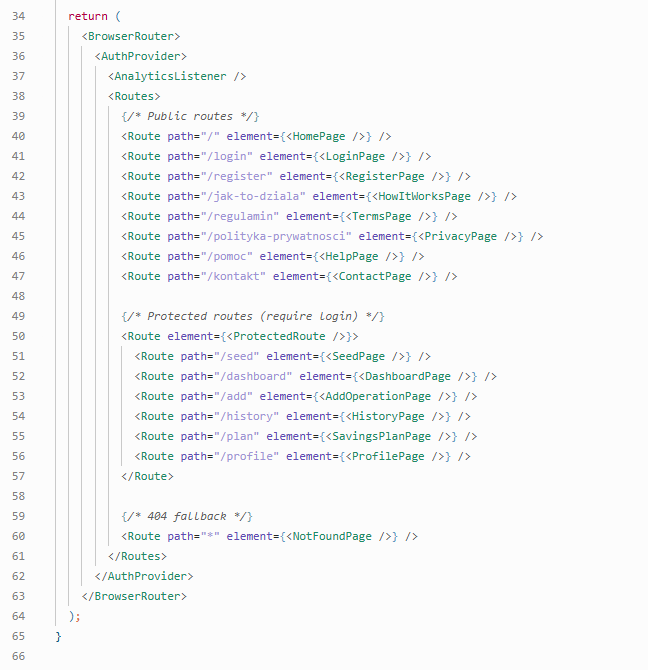

---

## Firebase Authentication

Aplikacja wykorzystuje **Firebase Authentication** do pełnej obsługi autoryzacji użytkowników.

### Obsługiwane metody logowania

| Metoda | Opis |
|---|---|
| **E-mail + hasło** | Standardowe logowanie z weryfikacją hasła |
| **Google (OAuth 2.0)** | Logowanie jednym kliknięciem przez konto Google |

### Konfiguracja

Klucze Firebase są przechowywane w zmiennych środowiskowych i wczytywane przez `src/firebase/config.js`. Domena produkcyjna (`generator-prostego-budzetu.netlify.app`) została ręcznie dodana do listy **Authorized Domains** w konsoli Firebase, co jest wymagane do działania logowania przez Google na środowisku Netlify.

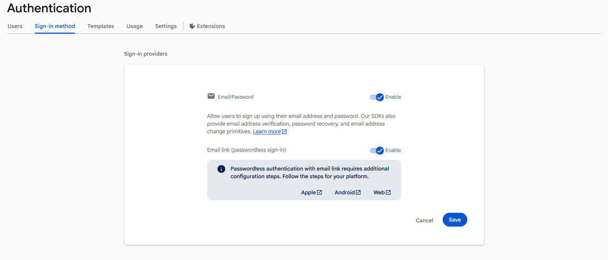

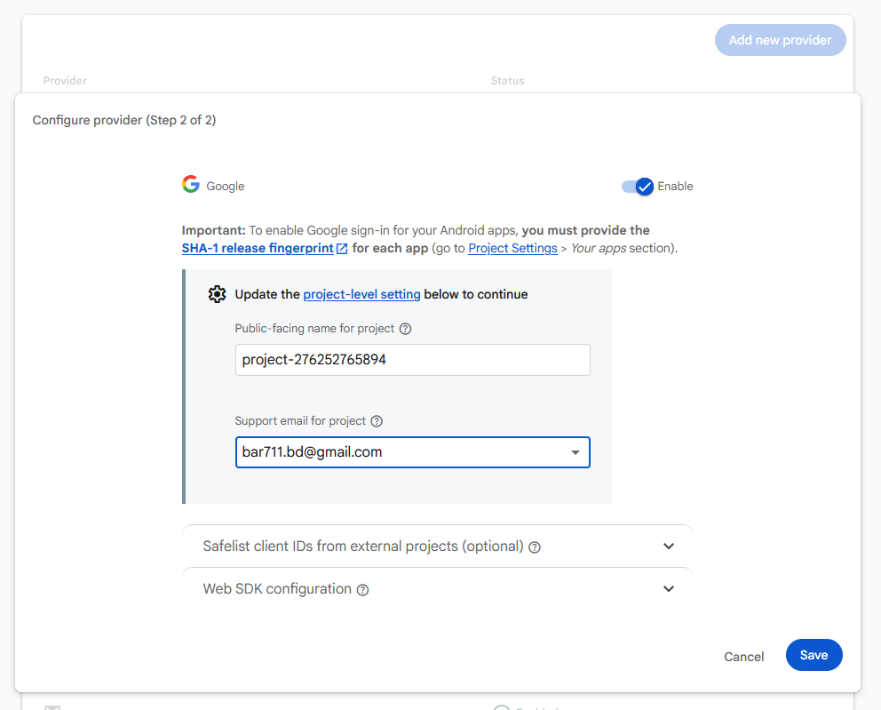

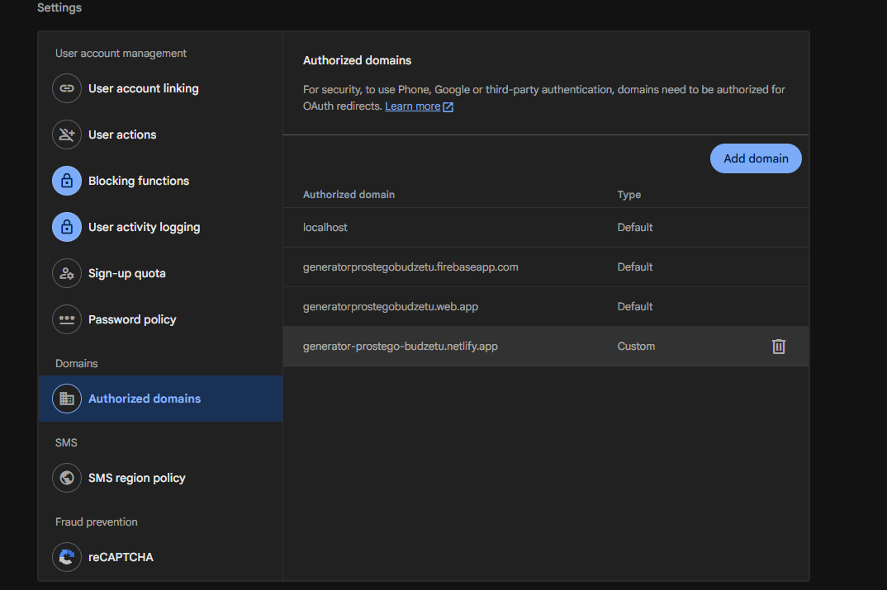

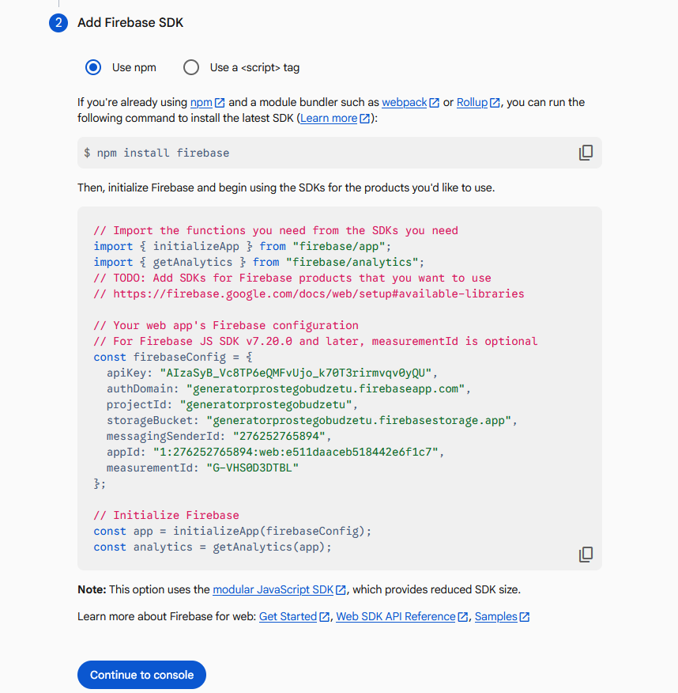

---

## Cloud Firestore

W projekcie utworzono bazę danych **Cloud Firestore** (tryb Standard) do przechowywania danych użytkowników.

### Struktura danych

```
users/
└── {userId}/
    ├── profile/          # Dane profilu (imię, nazwisko)
    ├── operations/       # Operacje finansowe (kwota, kategoria, typ, data, opis)
    └── savingsGoal/      # Cel oszczędnościowy (nazwa, kwota, termin, wpłaty)
```

### Reguły bezpieczeństwa

Dostęp do danych jest ograniczony wyłącznie do zalogowanego właściciela dokumentów:

```js
rules_version = '2';
service cloud.firestore {
  match /databases/{database}/documents {
    match /users/{userId}/{document=**} {
      allow read, write: if request.auth != null && request.auth.uid == userId;
    }
  }
}
```

Reguły uniemożliwiają odczyt lub zapis danych innego użytkownika, nawet jeśli ktoś zna jego `userId`.

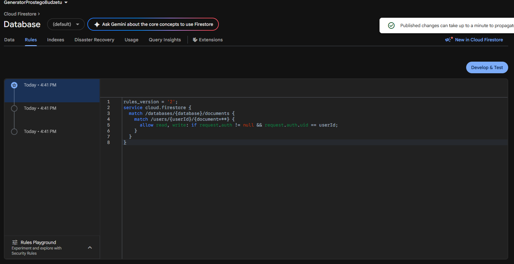

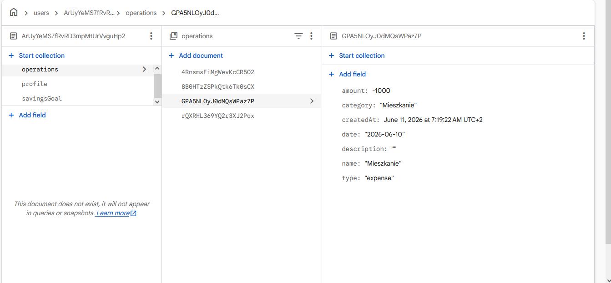

---

## Google Analytics

Projekt jest zintegrowany z **Google Analytics 4** przy użyciu biblioteki `react-ga4`.

### Jak działa integracja

Komponent `AnalyticsListener` jest renderowany wewnątrz `BrowserRouter` i nasłuchuje każdej zmiany trasy (`useLocation`). Przy każdej zmianie strony automatycznie wysyła zdarzenie `pageview` do GA4:

```jsx
// src/components/AnalyticsListener.jsx
import { useEffect } from 'react';
import { useLocation } from 'react-router-dom';
import ReactGA from 'react-ga4';

export default function AnalyticsListener() {
  const location = useLocation();

  useEffect(() => {
    ReactGA.send({
      hitType: 'pageview',
      page: location.pathname + location.search,
    });
  }, [location]);

  return null;
}
```

### Rejestrowane zdarzenia

| Zdarzenie | Opis |
|---|---|
| `page_view` | Każde przejście na inną stronę aplikacji |
| `session_start` | Rozpoczęcie nowej sesji użytkownika |
| `first_visit` | Pierwsza wizyta w aplikacji |
| `user_engagement` | Interakcja użytkownika ze stroną |
| `scroll` | Scrollowanie strony |

### Zebrane dane

W trakcie testowania aplikacji zebrano dane od **7 aktywnych użytkowników**, którzy wykonali łącznie **451 odsłon stron** i wygenerowali **506 zdarzeń**. Najpopularniejsze strony to: `/dashboard` (130 odsłon), `/add` (110 odsłon) i `/history` (51 odsłon).


---

## Hotjar / Contentsquare

Projekt jest zintegrowany z narzędziem **Contentsquare** (następca Hotjar) do analizy zachowań użytkowników. Skrypt śledzący jest załadowany bezpośrednio w `index.html`:

```html
<script src="https://t.contentsquare.net/uxa/4c874c34f6561.js"></script>
```

### Możliwości narzędzia

| Funkcja | Opis |
|---|---|
| **Heatmapa kliknięć** | Wizualizacja najczęściej klikanych miejsc na stronie |
| **Heatmapa ruchów myszy** | Śledzenie trajektorii ruchu kursora |
| **Scroll map** | Jak daleko użytkownicy scrollują stronę |
| **Zoning Analysis** | Analiza wskaźnika kliknięć w strefach strony z % udziałem |
| **Session Replay** | Nagrania pełnych sesji użytkownika |
| **Page Comparator** | Porównanie metryk między stronami (LCP, czas, bounce) |
| **Journey Analysis** | Ścieżki użytkowników między stronami |

### Dane zebrane podczas testów

Zebrano dane z **35 sesji** na 10 unikalnych stronach aplikacji. Narzędzie potwierdziło, że użytkownicy najczęściej klikają w:
- przyciski nawigacyjne (`Pulpit`, `Historia`, `Dodaj operację`)
- karty bilansu na dashboardzie
- przycisk `+ Dodaj operację`

> **Uwaga:** Nagrania sesji pojawiają się z kilkuminutowym opóźnieniem po zakończeniu wizyty. Przy małym ruchu dane mogą wymagać kilku dni zbierania.


---

## Deploy na Netlify

Aplikacja jest wdrożona na platformie **Netlify** i jest publicznie dostępna pod adresem `https://generator-prostego-budzetu.netlify.app`.

### Proces CI/CD

1. Kod źródłowy jest przechowywany w repozytorium GitHub: [BartoszDutka/generator-prostego-budzetu](https://github.com/BartoszDutka/generator-prostego-budzetu)
2. Netlify jest podłączone do repozytorium przez integrację z GitHub
3. Każdy push do gałęzi `main` automatycznie uruchamia nowy deployment
4. Netlify wykonuje: `npm install` → `npm run build` → publikuje katalog `dist/`

### Konfiguracja buildu

| Ustawienie | Wartość |
|---|---|
| Build command | `npm run build` |
| Publish directory | `dist` |
| Node version | 18 |
| Plik konfiguracyjny | `.npmrc` (`legacy-peer-deps=true`) |

### Zmienne środowiskowe w Netlify

Wszystkie klucze Firebase i GA4 są skonfigurowane jako zmienne środowiskowe w panelu Netlify (*Site configuration → Environment variables*), co zapewnia bezpieczne przechowywanie poufnych danych.

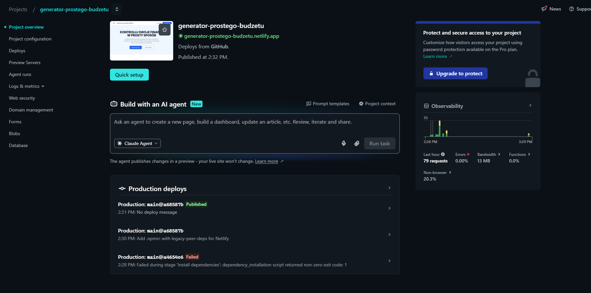

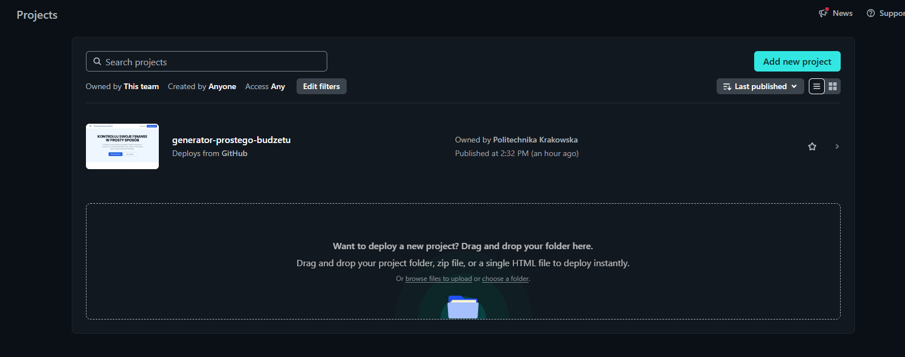

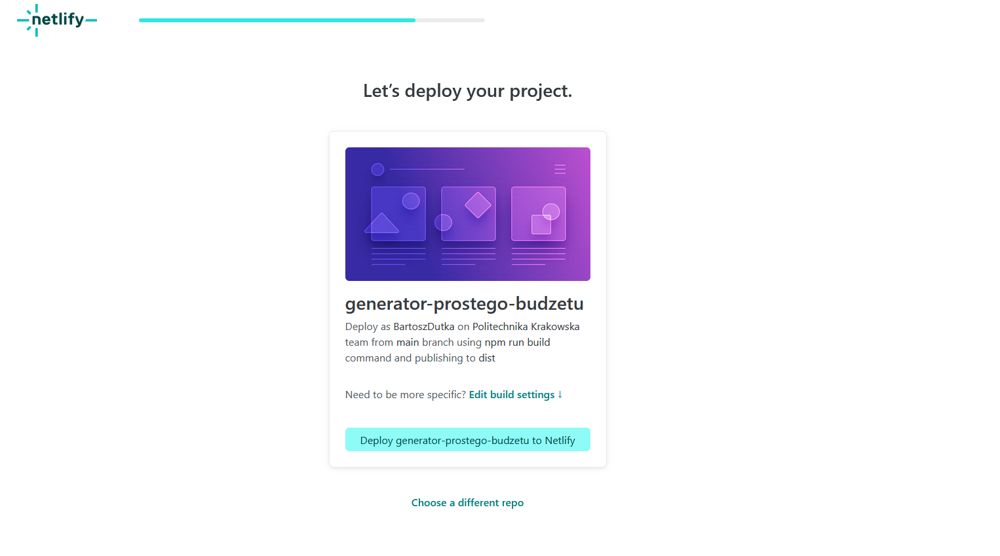

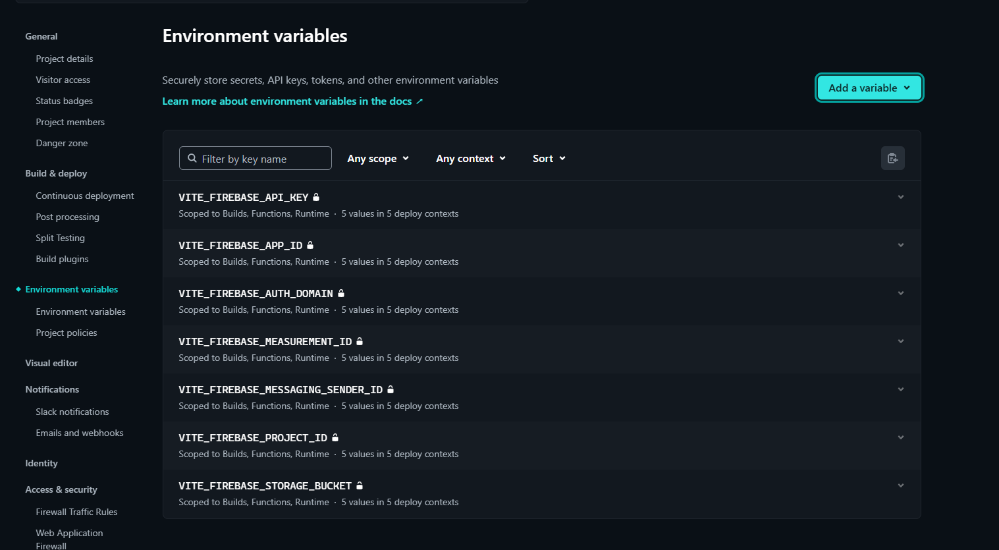

---

## Screeny aplikacji

### Strona główna

Publiczna strona powitalna z hero section, opisem funkcji aplikacji (Dodawaj przychody, Dodawaj wydatki, Analizuj budżet, Przeglądaj historię), sekcją "Twój finansowy kokpit" z podglądem wykresów oraz przyciskiem CTA.


### Logowanie

Formularz logowania z opcją e-mail/hasło oraz przyciskiem "Zaloguj się przez Google".


### Rejestracja

Formularz rejestracji z polami: imię, nazwisko, adres e-mail, hasło, potwierdzenie hasła oraz akceptacja regulaminu.


### Dashboard — Panel użytkownika

Główny widok po zalogowaniu. Wyświetla aktualny bilans, sumę przychodów, sumę wydatków, wykres wydatków według kategorii, kartę największego wydatku, plan oszczędnościowy oraz ostatnie operacje.


### Dodawanie operacji

Formularz do wprowadzania nowego wydatku lub przychodu. Pola: typ (Wydatek/Przychód), kwota, data, kategoria, opis.


### Historia operacji

Pełna lista transakcji posortowana po dacie z filtrowaniem po kategorii i typie operacji. Każda pozycja zawiera ikonę kategorii, datę, opis, typ i kwotę.


### Plan oszczędnościowy

Widok z kartą celu oszczędnościowego (progres 73%, kwota zaoszczędzona, pozostała i miesięczna wpłata), prognozą na 6 miesięcy oraz rekomendacją.


### Profil użytkownika

Widok zarządzania kontem: edycja danych osobowych (imię, nazwisko, e-mail), zmiana hasła, usunięcie konta.


### Jak to działa

Strona informacyjna prezentująca trzy kroki: Załóż konto, Dodaj transakcje, Analizuj wydatki.


### Centrum pomocy

Strona z FAQ (najczęściej zadawane pytania), kategoriami pomocy i formularzem kontaktowym.


### Formularz kontaktowy

Strona kontaktowa z formularzem (imię, e-mail, temat, wiadomość) oraz danymi biura.


### Strona 404

Własna strona błędu dla nieistniejących adresów URL.


---

## Problemy napotkane podczas realizacji

### 1. Konflikt zależności peer podczas deploymentu na Netlify

**Problem:** Build na Netlify kończył się błędem `ERESOLVE unable to resolve dependency tree`. Pakiet `eslint` w wersji wymaganej przez plugin Vite kolidował z wersją wymaganą przez inne zależności.

**Rozwiązanie:** Dodano plik `.npmrc` w katalogu głównym projektu z zawartością:
```
legacy-peer-deps=true
```
Instruuje to npm, aby ignorował konflikty wersji peer dependencies i kontynuował instalację. Po pushu tego pliku na GitHub Netlify wykonał build poprawnie.

---

### 2. Brak danych w Google Analytics po wdrożeniu

**Problem:** Po deploymencie na Netlify GA4 nie rejestrował żadnych danych. Panel Google Analytics pokazywał "Twoja witryna nie przesłała jeszcze żadnych danych."

**Przyczyna:** Zmienna środowiskowa `VITE_GA4_MEASUREMENT_ID` nie była skonfigurowana w ustawieniach Netlify. W środowisku Vite zmienne muszą być dostępne w czasie **buildu** (nie runtime), więc muszą być dodane w panelu Netlify przed deploymentem.

**Rozwiązanie:** Dodano zmienną `VITE_GA4_MEASUREMENT_ID` w panelu *Netlify → Site configuration → Environment variables* i wykonano ponowny deployment. Dane zaczęły spływać do GA4.

---

### 3. Logowanie przez Google — błąd Cross-Origin / unauthorized domain

**Problem:** Na środowisku produkcyjnym (Netlify) logowanie przez Google wyrzucało błąd w konsoli:
```
Cross-Origin-Opener-Policy policy would block the window.closed call
```
Dodatkowo Firebase zwracał błąd autoryzacji, ponieważ domena `generator-prostego-budzetu.netlify.app` nie była na liście dozwolonych.

**Rozwiązanie:** W konsoli Firebase (*Authentication → Settings → Authorized domains*) dodano domenę Netlify jako autoryzowaną. Po tej zmianie logowanie przez Google zaczęło działać poprawnie.

---

### 4. Contentsquare — brak danych bezpośrednio po instalacji

**Problem:** Po dodaniu skryptu Contentsquare do `index.html` panel narzędzia nie wyświetlał żadnych nagrań sesji ani heatmap przez kilka godzin.

**Przyczyna:** Contentsquare zbiera dane jedynie z ruchu rzeczywistego. Przy braku odwiedzin strony dane są puste. Nagrania sesji są przetwarzane asynchronicznie i pojawiają się z kilkuminutowym opóźnieniem.

**Rozwiązanie:** Po wygenerowaniu ruchu (wizyty w aplikacji, klikanie, scrollowanie) dane zaczęły się pojawiać w panelu. Narzędzie potwierdziło poprawną instalację komunikatem "Installation successful!".

---

### 5. PowerShell — brak operatora `&&`

**Problem:** Komendy w stylu `cd folder && npm install` powodowały błąd parsowania w PowerShell, który nie obsługuje operatora `&&` jako separatora poleceń.

**Rozwiązanie:** Zamiana `&&` na `;` lub wykonywanie komend oddzielnie:
```powershell
cd "C:\Users\...\projekt"; npm install
```

---

## Podsumowanie

Projekt **Generator Prostego Budżetu** spełnia wszystkie wymagania checklist TPF:

| Wymaganie | Status |
|---|---|
| Odwzorowanie widoków zgodnie z projektem Figma | ✅ |
| React jako framework frontendowy | ✅ |
| Routing przez React Router v6 | ✅ |
| Podział na strony (`pages/`) i komponenty (`components/`) | ✅ |
| Stylowanie przez Tailwind CSS | ✅ |
| Firebase Authentication (e-mail + Google) | ✅ |
| Cloud Firestore z regułami bezpieczeństwa | ✅ |
| Chronione trasy (`ProtectedRoute`) | ✅ |
| Google Analytics 4 (pageview + zdarzenia) | ✅ |
| Hotjar / Contentsquare (heatmapy, session replay) | ✅ |
| Deploy na Netlify z CI/CD przez GitHub | ✅ |
| Dokumentacja README z screenami aplikacji | ✅ |
| Screeny użycia Google Analytics | ✅ |
| Screeny aplikacji w Hotjar / Contentsquare | ✅ |

---

## Autorzy

**Bartosz Dutka**  
**Patryk Gal**  
Politechnika Krakowska  
Przedmiot: TPF — Technologie i Platformy Frontendowe  
Rok akademicki: 2025/2026
